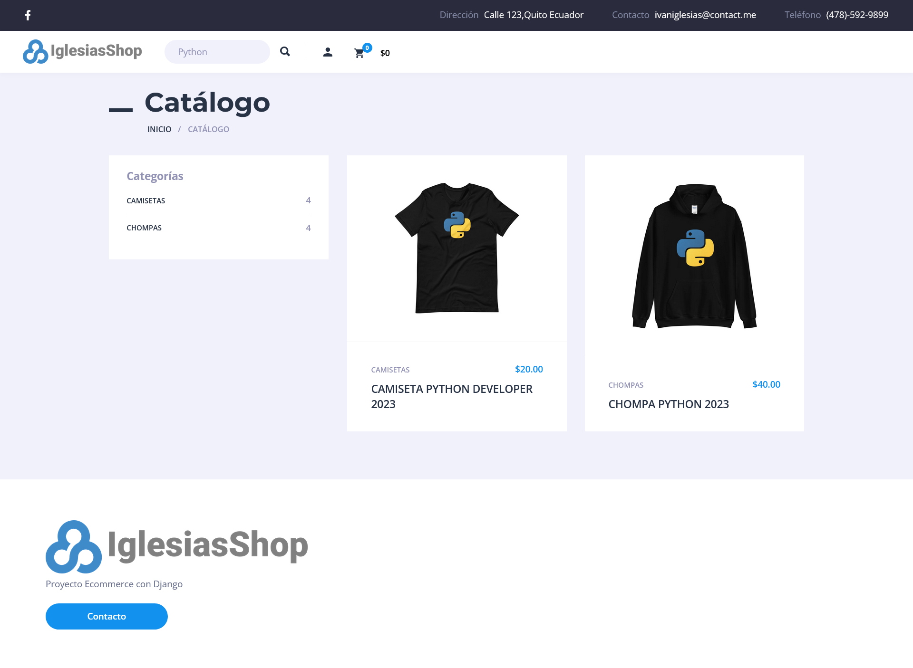
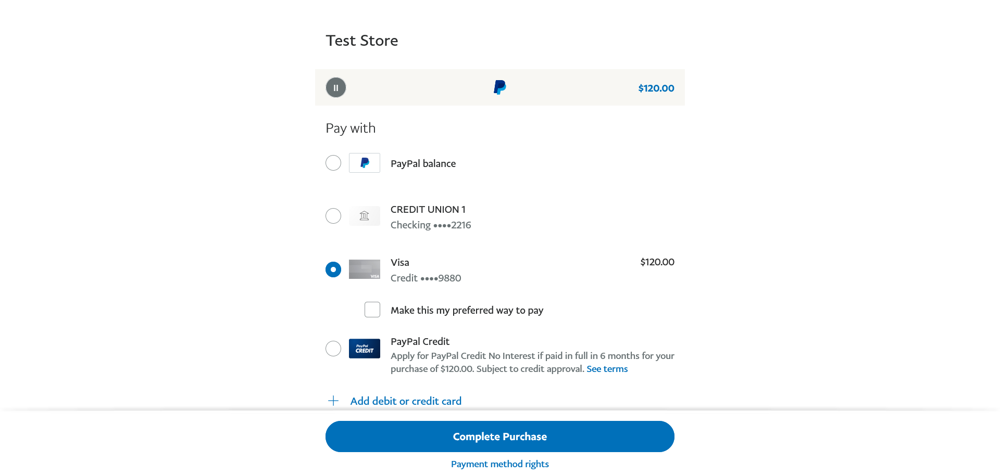

# IglesiasShop
Complete E-Commerce project, created with Django &amp; Python, deployed w/ Docker.

## Features

- Data managed with MySQL Data Base
- User registration and authentication
- Product listings with categories and search
- Product details page
- Shopping cart management
- Order review
- Checkout with PayPal integration

## Screenshots

Here are some screenshots of the web application:








## Getting Started

To get started with the project, you need to have Python and Django 3.2 installed on your virtual environment. You can then clone the repository and install the required packages using the following commands:

```
git clone https://github.com/Jefe21054/IglesiasShop.git
cd IglesiasShop
pip install -r requirements.txt
```

You also need to create a `.env` file in the project directory with the following variables:

```
SECRET_KEY=<your-secret-key>
DEBUG=<True-or-False>
ALLOWED_HOSTS = <your-allowed-hosts>
DATABASE_NAME = <your-db-name>
DATABASE_USER = <your-db-user>
DATABASE_PASS = <your-db-password>
DATABASE_HOST = <your-db-host>
DATABASE_PORT = <your-db-port>
EMAIL_HOST = <your-email-host>
EMAIL_HOST_USER = <your-email-host-user>
EMAIL_HOST_PASSWORD = <your-email-host-password>
EMAIL_PORT = <your-email-host-port>
PAYPAL_TEST = <True-or-False>
ADMIN_USER_EMAIL = <your-email-address>
PAYPAL_USER_EMAIL = <your-paypal-sandbox-email-address>
```

Once you have set up the environment, you can run the development server using the following command:

```
python manage.py runserver
```

## Deployment

The application can be deployed on any cloud platform that supports Python and Django applications. In my case, I use Docker and Docker compose to deploy the project on Digital Ocean.

## Built With

- Django - The web framework used
- Python - Programming Language
- HTML - Markup Language
- CSS - Styling Language

## Contributing

Contributions are always welcome! If you find any bugs or want to add new features, feel free to open an issue or send a pull request.

## Acknowledgments

- [Django Documentation](https://docs.djangoproject.com/en/3.2/) for providing a comprehensive guide to Django development.

## Demo

To see a live demo of the project, please go <a href="http://165.227.66.210/">HERE</a>.
